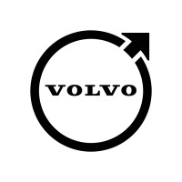
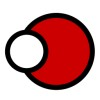

<h4 align="right">

I do love <ins>challenges</ins>.

</h4>

---

<h6 align="center">

<samp><strong>#Enthusiastic #Diligent #DevOps #Cloud #Engineer</strong></samp>

</h6>

<h1 align="center">

<b>[👔](#-work-experience) | [🧰](#-toolkit) | [💬](#-reach-out-to-me)</b>

</h1>

<h5 align="center">

I have worked on many kinds of products, mostly on building private cloud systems, developing over them and keeping them healthy & high quality.
Those systems were highly available, scalable, fault-tolerant clusters with massive storage capacities.

<h5>

<h6>

In my work time, I do

</h6>

<h5>

- ⚙️ <ins>Automate</ins> things & construct pipelines,
- 📊 Visualise and <ins>monitor</ins> data & metrics,
- ☁️ Provision and <ins>maintain</ins> servers & services,
- 🧩 Build <ins>microservices</ins> using modern technology

</h5>

<h6>

Also, I assure

</h6>

<h5>

- 👣 <ins>Documentation</ins> of our successes and failures
- ♻️ Maintainable and <ins>well-structured</ins> code,
- 🚀 Enthusiasm and <ins>diligence</ins>,
- 🗣️ Constructive <ins>feedback</ins> and openness to criticism,

</h5>

### 👔 Work Experience

<h5>

 

**Software Engineer (DevOps & QA)** - [**Volvo Cars**](https://www.volvocars.com/)  
May 2022 - Present

 

**Software Engineer (Full-stack & DevOps)** - [**retinadata**](https://www.retinadata.com/)  
Aug 2018 - Apr 2022

 

**Software Developer (Full-stack)** - [**aktos electronics**](https://aktos.io/)  
Jun 2015 - Aug 2017

 

<b>[Repositories](https://github.com/mustafacansevinc?tab=repositories) | [LinkedIn](https://www.linkedin.com/in/mcansevinc/)</b>

</h5>

### 🧰 Toolkit

<h6>

The main tools I feel *comfortable* with

</h6>

<a href="https://github.com/mustafacansevinc">

![aws][aws-badge]
![azure][azure-badge]
![kubernetes][kubernetes-badge]
![docker][docker-badge]
![elasticsearch][elasticsearch-badge]
![kibana][kibana-badge]
![grafana][grafana-badge]
![loki][loki-badge]
![prometheus][prometheus-badge]
![ansible][ansible-badge]
![tf][tf-badge]
![jenkins][jenkins-badge]
![python][python-badge]
![go][go-badge]
![csharp][csharp-badge]
![dotnet][dotnet-badge]
![bash][bash-badge]
![vue][vue-badge]
![ceph][ceph-badge]

</a>

<h6>

I've also done more than just *get my feet wet*, in technologies like

</h6>

<a href="https://github.com/mustafacansevinc">

![graphql][graphql-badge]
![apollo][apollo-badge]
![nginx][nginx-badge]
![kafka][kafka-badge]
![postgresql][postgresql-badge]
![consul][consul-badge]
![maas][maas-badge]
![wireshark][wireshark-badge]
![cockpit][cockpit-badge]
![vagrant][vagrant-badge]
![lua][lua-badge]
![firebase][firebase-badge]
![flutter][flutter-badge]

</a>

### 💬 Reach Out to Me

[![linkedin][linkedin-badge]](https://www.linkedin.com/in/mcansevinc/)
[![mail][mail-badge]](mailto:mcansevinc@gmail.com)
[![website][website-badge]](http://cansevinc.com.tr/)

<!--
Tech Badge References
-->
[kubernetes-badge]:https://img.shields.io/badge/kubernetes-326ce5.svg?&style=for-the-badge&logo=kubernetes&logoColor=white
[ceph-badge]:https://img.shields.io/badge/ceph-f0424d?style=for-the-badge&logo=ceph&logoColor=white
[docker-badge]:https://img.shields.io/badge/Docker-2CA5E0?style=for-the-badge&logo=docker&logoColor=white
[python-badge]:https://img.shields.io/badge/Python-FFD43B?style=for-the-badge&logo=python&logoColor=blue
[jenkins-badge]:https://img.shields.io/badge/Jenkins-D24939?style=for-the-badge&logo=Jenkins&logoColor=white
[ansible-badge]:https://img.shields.io/badge/Ansible-000000?style=for-the-badge&logo=ansible&logoColor=white
[bash-badge]:https://img.shields.io/badge/bash-121011?style=for-the-badge&logo=gnu-bash&logoColor=white
[aws-badge]:https://img.shields.io/badge/AWS-FF9900?style=for-the-badge&logo=amazonaws&logoColor=white
[elasticsearch-badge]:https://img.shields.io/badge/ElasticSearch-0779A1?style=for-the-badge&logo=elasticsearch&logoColor=white
[kibana-badge]:https://img.shields.io/badge/Kibana-EF5098?style=for-the-badge&logo=Kibana&logoColor=white
[go-badge]:https://img.shields.io/badge/Go-00ADD8?style=for-the-badge&logo=go&logoColor=white
[vue-badge]:https://img.shields.io/badge/Vue.js-35495E?style=for-the-badge&logo=vuedotjs&logoColor=4FC08D
[nginx-badge]:https://img.shields.io/badge/Nginx-009639?style=for-the-badge&logo=nginx&logoColor=white
[grafana-badge]:https://img.shields.io/badge/grafana-orange?style=for-the-badge&logo=grafana&logoColor=white
[loki-badge]:https://img.shields.io/badge/loki-2C3239?style=for-the-badge&labelColor=2C3239&logo=data:image/png;base64,iVBORw0KGgoAAAANSUhEUgAAABwAAAAcCAYAAAByDd+UAAAABGdBTUEAALGPC/xhBQAAACBjSFJNAAB6JgAAgIQAAPoAAACA6AAAdTAAAOpgAAA6mAAAF3CculE8AAAACXBIWXMAAAsTAAALEwEAmpwYAAABWWlUWHRYTUw6Y29tLmFkb2JlLnhtcAAAAAAAPHg6eG1wbWV0YSB4bWxuczp4PSJhZG9iZTpuczptZXRhLyIgeDp4bXB0az0iWE1QIENvcmUgNS40LjAiPgogICA8cmRmOlJERiB4bWxuczpyZGY9Imh0dHA6Ly93d3cudzMub3JnLzE5OTkvMDIvMjItcmRmLXN5bnRheC1ucyMiPgogICAgICA8cmRmOkRlc2NyaXB0aW9uIHJkZjphYm91dD0iIgogICAgICAgICAgICB4bWxuczp0aWZmPSJodHRwOi8vbnMuYWRvYmUuY29tL3RpZmYvMS4wLyI+CiAgICAgICAgIDx0aWZmOk9yaWVudGF0aW9uPjE8L3RpZmY6T3JpZW50YXRpb24+CiAgICAgIDwvcmRmOkRlc2NyaXB0aW9uPgogICA8L3JkZjpSREY+CjwveDp4bXBtZXRhPgpMwidZAAAFFUlEQVRIDc2WzWtcZRTGn/s9M0knySRtPhsXgVJa0UYKalcioogbcSWCuBLX/hn+C65cuBFBFy5FYkDBWix+UGsbP9pmknSapMlMMt9z7/V3btI0aRF0svGl07nz3nvPc57nPOe8cc49cykVK+FzKkg05Enj+Vivn2zrw3Je5barRuwocCT+qZc9bW/0t1x7zcByTqoLJ2K9MdFSueWpmEv19mRL42Ein/vTYawzhVjJMQEtVhZkjmAXil3NDCSq9RwlpDI9mGgiIh1AXhnragTQn3YG5ZJcvysDTFNHxUA6W4zVBcgC7tqem2qikGjETzU/3FMLnIi9GDSTt5+VSWoAqx03Y+UDPBSk2ui5SklnGuZ3ued5qXJhqiIS988PMpal/bfZddQh7cRY5ROtttgFZByJ14024D6JnETixIre58oAHYB2AdxFqJSdGcxTbrhyYTucT9VEQ8NMcfAkCRzHOBmgJdtNHFgiIzvTg7FWm55cWJmMAUxr1DQB0IyU9l3BfUkN0OqyhqYOIKdOJNriOgXIwzDGcoM6GsMp2B9nHTB0kXWtASuCFgHoELdJ5IQEppDRaupwb4xr/+Ct/w598Cr5a8UAMUbEJw+z6r7Ep4s9letWU1xaSDXAROrXqQ8BYXivSZ34NlnHBlJVqKO1xuRwortWU0wURqlKuf6degBoTq22HTVI3VpjmiFQrsEKpmPFRNvcs33HWoXf/Tr1ISDlaNMaVWt4dmdGkHFnj9UJamoATeibU2eGbKaSYR/rANDe7RGkQv9lbkTGCnWz5reGLyDl1gOnkkzaZxGPAFrOq7smozRKa9RpjZ5lgqzWKncxlTl1YiSRe+RNe+jfrSOvWWus1Dx5xoihnU0gJLaT43QJiampuDcCeI4k/omkJe7xaMgzNjgOL7g8XDbEKwBaDV0MUmSm3oNxhJzG+MqtQJtNV3UMFBGsSc1tCllw+x3i4giAAp9B6j7M4HeI+fW1nHoc4pbII4AMcWp4r4GU0LK6/bwSqErtKhjo9magb5ZitQByza0MgbmJXnZYl0hoFPeOMolKfJcYj6XBVDvE+n4pUpVvU+wIoG00qNvCjVx2s8X15b+CbHiboeotmMNifq6tW/d9nZno6r3XdlWAXcS+gyo2oRoc4E1UqOy42qi6CgzFlH0U0MTt4pI1avXCU235PHj1z0DvvlwnmHTtzoheerqt+XMt/fh7lJmqjlSVbVc1lKlhqirDo4q7d1skCGgH8IC6P1hHGNpmTK89OdvTWy/W9dUPOV1eCrNmb8LWx6GL1yPaxVGNWi6tBvpkgVpyr8sZ6XE/z3k5xPibGo81Ohxr8mRPXywO6LNKQSEKPAZodr9eDvTl1ZxuLIcEdvTRwgBZ7kn27a+h2kyBPIZodgI9MdXTLJ8xhkGJo8vMEsLI+rQJO6qg0hCzd5/kY4A+Zri54mvhl2jvZerjeI6ev9ikPo7Wtzy9/2ZNt9d8Xb0Z6dnzbZXGYtWRdBvWyxuOtqndfdxu9bPvG7eDA1kfA7RMrCXeebWuWRz4GyzPzHb13HxLy8u+bi4HulUJtLzuZVb/dLGQ9VrlvqdNALYAqALegFqXHo4xkanmEdOWAe6TzX5nvWKF3qLw/paPcVJ9dy2k+QcwSqi1TVcffFwksJvN3s8BTGzGUkNzuQXn6N67pgdtah1ezvmLl64c3nhwffFsJ5PwjzuBdjiJLaD9aWGZdulD+yvOXPy/X38Dy2M5JJe3rzYAAAAASUVORK5CYII=
[prometheus-badge]:https://img.shields.io/badge/Prometheus-000000?style=for-the-badge&logo=prometheus&labelColor=000000
[kafka-badge]:https://img.shields.io/badge/Kafka-231F20?style=for-the-badge&logo=apache-kafka&logoColor=white
[graphql-badge]:https://img.shields.io/badge/GraphQl-E10098?style=for-the-badge&logo=graphql&logoColor=white
[apollo-badge]:https://img.shields.io/badge/Apollo-311C87?&style=for-the-badge&logo=Apollo%20GraphQL&logoColor=white
[postgresql-badge]:https://img.shields.io/badge/PostgreSQL-316192?style=for-the-badge&logo=postgresql&logoColor=white
[dotnet-badge]:https://img.shields.io/badge/.NET-512BD4?style=for-the-badge&logo=dotnet&logoColor=white
[csharp-badge]:https://img.shields.io/badge/C%23-239120?style=for-the-badge&logo=c-sharp&logoColor=white
[vagrant-badge]:https://img.shields.io/badge/Vagrant-1868F2?style=for-the-badge&logo=Vagrant&logoColor=white
[lua-badge]:https://img.shields.io/badge/Lua-2C2D72?style=for-the-badge&logo=lua&logoColor=white
[flutter-badge]:https://img.shields.io/badge/Flutter-02569B?style=for-the-badge&logo=flutter&logoColor=white
[firebase-badge]:https://img.shields.io/badge/firebase-ffca28?style=for-the-badge&logo=firebase&logoColor=black
[tf-badge]:https://img.shields.io/badge/Terraform-7B42BC?style=for-the-badge&logo=terraform&logoColor=white
[azure-badge]:https://img.shields.io/badge/Azure-0078D7?style=for-the-badge&logo=azure-devops&logoColor=white
[wireshark-badge]:https://img.shields.io/badge/wireshark-green?style=for-the-badge&logo=wireshark&logoColor=white
[cockpit-badge]:https://img.shields.io/badge/cockpit-black?style=for-the-badge&logo=cockpit&logoColor=white
[consul-badge]:https://img.shields.io/badge/consul-dc477d?style=for-the-badge&logo=consul&logoColor=white
[maas-badge]:https://img.shields.io/badge/maas-orange?style=for-the-badge&logo=maas&logoColor=white

<!--
Social Badge References
-->
[linkedin-badge]:https://img.shields.io/badge/LinkedIn-0077B5?style=for-the-badge&logo=linkedin&logoColor=white
[mail-badge]:https://img.shields.io/badge/Gmail-D14836?style=for-the-badge&logo=gmail&logoColor=white
[website-badge]:https://img.shields.io/badge/website-000000?style=for-the-badge&logo=About.me&logoColor=white
